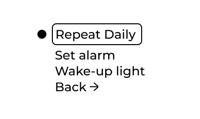
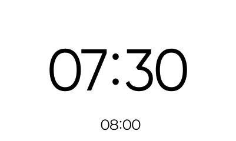

# How to set up your alarm
Follow this guide to set up alarms on your bedside clock.

## Schedules
There is three schedules to choose between when it comes to how and when the alarms should repeat. 

**Repeat Daily**
Repeats one alarm time every day.

**Weekdays**
Repeats one alarm time monday to friday. No alarm on the weekend.

**Custom**
Set individual alarm times for every day of the week. Individual days can be disabled/enabled.

Only one schedule can be used at a time. Alarm times saved in each schedule mode will persist when switching between schedules.
## Select Sound
Navigate through the sound options and hear a short excerpt of the sound at a moderate volume. After selecting a sound you can save your desired volume. 
## Wake-up light
The wake-light function will gradually turn on the built-in nightlight before your alarm starts. 

By default this function is off. Choose between 1 minute, 5 minutes, 10 minutes, or 30 minutes before your alarm goes off.

The setting is set for all enabled alarms no matter the schedule.

> [!NOTE]
> Learn how to connect your [smart home lights](Connectivity/Philips_Hue) to work in junction with the built-in wake-up light.

## Confirm your alarm
Active alarms that are within the next 24 hours will show up below the current time on the main watch face. 

If wind down reminder is enabled it will also show up below the current time. 
Times are shown in sequential order.

## Controls
Learn about [Controls](Getting_started/Controls.md) for stopping, snoozing, and skipping alarm.