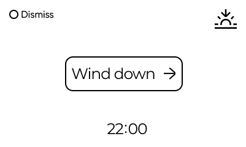

# Wind down reminder setup
The wind down reminder will display a message on your clock at the set time for you to wind down. You can either play a soundscape or dismiss the message.

## How to set up
Go to "Wind down" and set time and select a sound.

The time is when the message will appear. The message will auto dismiss after 20 minutes if no action has been taken.

The sound saved is your preferred sound. You can choose to play your preferred sound when the reminder is active, or you can select another from the list.

**Start playing sounds**
When the wind down message appear you can choose to start the experience by pressing the encoder button.

Sounds will play for maximum 45 minutes. Any alarm during the playback will interrupt the sound.

Pause the sound by pressing snooze button.

**Dismiss**: 
Dismiss the message with the stop button.

> [!NOTE]
> **Repeats daily**
> All wind down reminders repeats on daily basis to support a consistent bedtime routine.
> 
